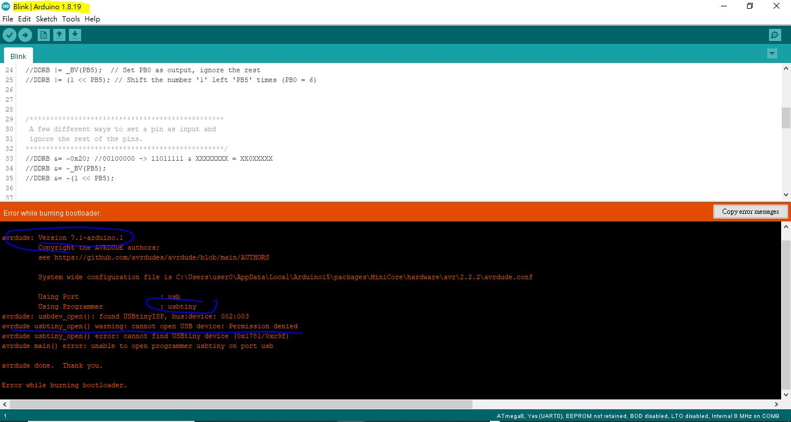
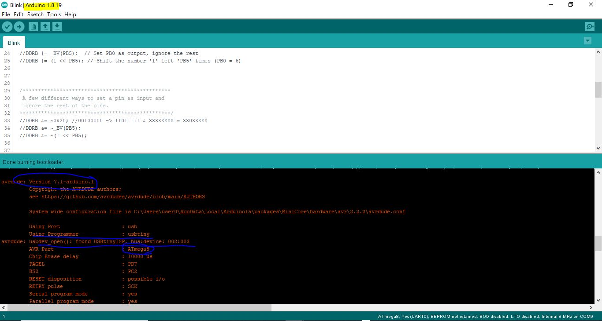
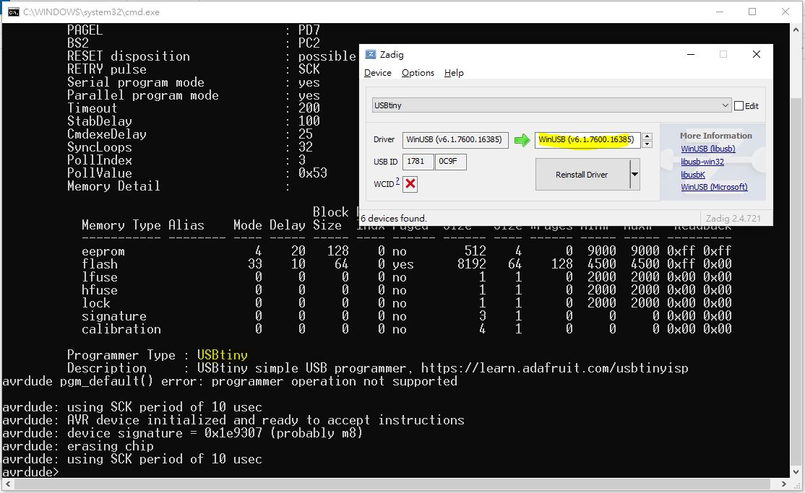

# usbtiny-ATtiny2313-libusb_winusb
AVRdude 6.3 is ok with libusb driver, but not the 7.1  

someday AVRDUDE updated to 7.1,  arduino IDE or other platform, win10, no longer working.  

libusb driver was good for AVRdude 6.3 or prior  
winusb driver is a  must for AVRdude 7.1  

so to replace the driver is a must to continous the Arduino IDE support to burn chip as long as USBtiny is used.  

libusb used, error  
   

winusb used ok, test, minicore, Atmega8  
  

winusb driver v6.1.1700.16385, not working with Avrdue 6.3, but ok with 7.1  
  

### Zadig, the tool
https://zadig.akeo.ie/  
[zadig-2.8.exe](zadig-2.8.exe)  

### this is why,  
https://github.com/avrdudes/avrdude/wiki/Troubleshooting-USB-devices-in-Windows  
https://github.com/MCUdude/MiniCore/issues/253  
